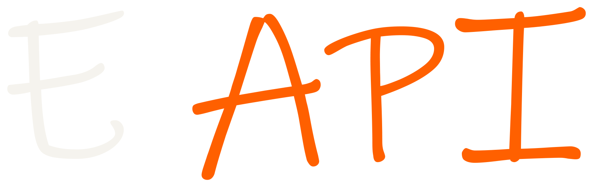
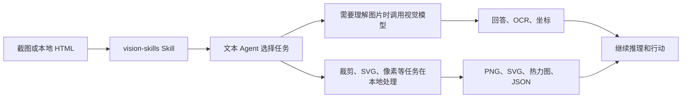

<p align="center">
  
</p>

<div align="center">

# DSH Vision Toolkit

<a href="https://trendshift.io/repositories/149708?utm_source=trendshift-badge&amp;utm_medium=badge&amp;utm_campaign=badge-trendshift-149708" target="_blank" rel="noopener noreferrer"></a>

[](https://dshfind.com/zh/plugins/Anionex/dsh-vision-toolkit)
[](https://dshfind.com/zh/plugins/Anionex/dsh-vision-toolkit)
[](https://www.npmjs.com/package/@mengruo/dsh-vision-toolkit)

[](LICENSE)
[](cordis.patch.yml)

**更强大的视觉工具箱——给 DeepSeek Harness 里的纯文本模型装上眼睛：图片问答、长图 OCR、前端 UI 还原、GUI 视觉任务，一套视觉工具箱和一个 Skill。**

🚀 粘贴图片，直接提问 ｜ 一行命令安装即用 ｜ 场景丰富

[亮点](#亮点) ｜ [快速开始](#快速开始三步完成) ｜ [工具一览](#工具一览) ｜ [配置与限制](#配置与限制) ｜ [常见问题](#常见问题) ｜ [交流群](#开发与社区)

🌐 [English](README.md) ｜ **中文**

</div>

🏆 本项目为deepseek harness生态首个综合性视觉工具插件：内测前已立项，并在内测期间参考本人的[`agent-vision-toolkit`](https://github.com/Anionex/agent-vision-toolkit)做出。

> **原创声明：** 这套视觉工具的体系和划分方式，以及 `vision-skills` Skill，均由作者个人原创并持续打磨，相关工具、方法和工作流来自长期的真实使用与反复迭代。

> 如果这个项目对你有帮助，或给了你一些灵感，欢迎 Star 🌟 & Fork。

## 亮点

- **粘贴图片，直接提问。** 在 DSH Web 里粘贴图片，文本模型会自动切换到看图模式变体，不需要手动复制路径或更换模型。图片保留原生缩略图、会话记录和工作区路径；Web 可以预览产物。
- **一行命令安装即用。** 安装插件后即可在 **设置 → 视觉工具** 中配置视觉模型并开始使用。
- **不只是看图描述，是获取图中真正需要关注的内容。** 模型不只是生成通用描述，而是围绕“报错在哪里”“按钮在哪”等当前任务提取证据。
- **一套经过实战验证的视觉任务方法论**：项目提供的skill，会告诉 agent 面对不同视觉任务时应该看什么、选择哪个工具、按什么步骤推进，以及最后如何验证结果。

[`agent-vision-toolkit`](https://github.com/Anionex/agent-vision-toolkit) 的视觉能力不只停留在图片描述：Agent 可以读取、定位、裁剪、描摹、还原和验证视觉内容。DSH Vision Toolkit 是这套工具箱面向 DeepSeek Harness 的原生接入，让它进入 Web 和 Headless Profile。

本项目提供两层能力：

1. **视觉工具和 Skill**：让 Agent 知道什么时候该看图、定位、OCR、裁剪、描摹或做像素对比。
2. **DSH 原生接入**：把这些能力放进 Profile、会话、Settings、Artifacts 和 Web 界面。

```sh
dsh plugin --profile web add @mengruo/dsh-vision-toolkit
```

**上游工具箱：** [Anionex/agent-vision-toolkit](https://github.com/Anionex/agent-vision-toolkit) · **项目网站：** [agent-vision.anionex.me](https://agent-vision.anionex.me)

## ❤️ 赞助

> 想赞助本项目？详见 [FUNDING.md](FUNDING.md) 或发送邮件到 davidyang042@gmail.com。

<details open>
<summary>点击折叠</summary>

<table>
<tr>
<td width="220" align="center" valign="middle"><a href="https://aihubmix.com/?aff=sinZ"></a></td>
<td valign="middle">感谢 <a href="https://aihubmix.com/?aff=sinZ">AIHubMix</a> 赞助本项目！AIHubMix 是稳定、高并发的 AI 大模型 API 聚合平台，一个 API Key 即可接入 Claude、GPT、Gemini、DeepSeek 等主流模型，兼容多种协议，并提供<b>免费模型选择</b>。注册时，海外用户请使用 <a href="https://aihubmix.com/?aff=sinZ">AIHubMix 入口</a>，中国大陆用户请使用 <a href="https://inferera.com/?aff=sinZ">Inferera 入口</a>。</td>
</tr>
<tr>
<td width="220" align="center" valign="middle"><a href="https://api.ewo.so/register?aff=U6PT7J"></a></td>
<td valign="middle">感谢 <a href="https://api.ewo.so/register?aff=U6PT7J">E-API</a> 赞助本项目！E-API 聚合主流 AI 模型，兼容 OpenAI、Anthropic 与 Codex 接口；部分 Claude 模型相比官方价<b>最高优惠约 98%</b>，DeepSeek V4 系列<b>优惠约 25%</b>。</td>
</tr>
</table>

</details>

**目录**

- [亮点](#亮点)
- [最近更新](#最近更新)
- [适合谁用](#适合谁用)
- [实际效果](#实际效果)
- [快速开始：三步完成](#快速开始三步完成)
- [工具一览](#工具一览)
- [配置与限制](#配置与限制)
- [常见问题](#常见问题)
- [赞赏](#赞赏)
- [开发与社区](#开发与社区)

## 最近更新

- **2026-08-20 · AIHubMix 申请教程：** 新增通过 Inferera 入口申请 API Key 并配置 Gemini 3.7 Flash 视觉模型的图文教程，并在视觉工具设置中直接提供入口。
- **2026-08-19 · 透明变体路由默认开启：** 模型选择器默认只显示每个模型一项并保留原模型名，粘贴图片、历史图片和内置 `read_image` 工具都能直接使用，不再需要手动切换到 `(Vision Toolkit)` 变体；如需恢复显式条目，可在 设置 → 高级设置 → 图片输入 关闭“透明变体路由”。
- **2026-08-16 · Windows Python：** 支持 Microsoft Store Python，解决 Windows 用户首次创建隔离环境失败的问题。
- **2026-08-17 · 视觉升级：** 默认模型切换到 Gemini 3.7 Flash，并修复 Qwen/Gemini 检测框坐标顺序错位的问题。
- **2026-08-16 · 图片粘贴：** 文本模型自动切换到 `(Vision Toolkit)` 变体并保留工作区路径，解决粘贴图片被拦截或后续无法复用的问题。
- **2026-08-16 · 服务稳定性：** 扩大服务容量，减少高峰期出现 `429` 的情况。
- **2026-08-16 · 真实模型测试：** Settings 新增完整图片请求测试，解决 `/models` 可访问却不能证明模型真的会看图的问题。

## 适合谁用

1. 想获得类似多模态模型一样的交互体验：直接粘贴图片，提出要求或疑问
2. 不只是看图问答，想要完成更复杂、更有价值的视觉任务，例如草图变前端页面，图片转html，提取长截图里的聊天信息等等；后续也会不断补充更多的场景。

随附的 `vision-skills` Skill 携带完整的上游 playbook，说明每个工作流何时使用、按什么顺序调用工具，以及如何验证结果：

| 手册 | Agent 学会做什么 |
| --- | --- |
| [读取长截图、聊天记录和滚动页面](assets/skill/references/long-screenshot-ocr.md) | 找到低内容切割带、按顺序 OCR 每个分块、保留聊天发言人/时间戳/引用、只合并重复的重叠部分，并标出有风险的边界供验证 |
| [根据截图或设计重建 UI](assets/skill/references/restore-ui.md) | 优先复用项目组件和素材，再用代码原生 UI、提取的视觉素材、渲染截图和视觉对比来对齐页面或组件 |
| [还原图标、Logo、插画或其他图形](assets/skill/references/restore-graphic.md) | 从源图像提取透明 PNG，或按需重建可编辑/可缩放 SVG，然后验证形状、颜色和 alpha 边缘 |
| [把草图、示意图或白板转成结构化代码](assets/skill/references/restore-structure.md) | 把节点、标签、连接和方向恢复为可编辑的 Mermaid、Graphviz 或其他结构化表示 |
| [通过截图操作 GUI](assets/skill/references/gui.md) | 定位控件、执行一个动作、再次截图，并先验证结果状态再继续 |


## 实际效果

### 在 DSH 里直接粘贴图片提问

<p align="center">
  
</p>

*用户粘贴一张图片，纯文本模型自动切换到对应的* `Vision Toolkit` *变体，并围绕用户的问题读取画面。*

### 从截图到可编辑页面

<p align="center">
  
  
</p>

> 提示词示例：“（使用vision-skills），把这张图片还原成html”

*左：参考截图；右：用 HTML/CSS 还原出的可编辑结果。视觉结果可以继续进入截图和像素对比流程，而不是停在“描述图片”。*

### 从手绘稿到可用界面

<p align="center">
  
  
</p>

*左：手绘参考；右：根据参考还原的可用界面。*

> 提示词示例：“（使用vision-skills），把这张草稿图做成可用的前端页面”

### 快速 UI 还原：先出一版近似稿

<p align="center">
  
  
</p>

> 提示词示例：“（使用vision-skills），把这张图片 快速 还原成html”

*左：原始页面；右：保留主要布局、内容和视觉层级的快速还原稿，允许颜色和图标库近似。快速模式的目标是约三分钟内产出首版截图。*

## 快速开始：三步完成

### 1. 安装

```sh
dsh plugin --profile web add @mengruo/dsh-vision-toolkit
```

Headless Profile 也可以安装：

```sh
dsh plugin --profile headless add @mengruo/dsh-vision-toolkit
```

使用 **DSH Desktop 桌面版**？桌面版自带 `dsh` 命令行，但有意不写入系统 PATH，请不要在系统终端里执行上面的命令。请从托盘打开 **DSH 终端（Open DSH Terminal）**，在桌面版自己的终端中安装到 Desktop Profile：

```sh
dsh plugin --profile desktop add @mengruo/dsh-vision-toolkit
```

安装完成后重启 DSH Desktop。DSH Desktop 2.0.1 内置插件市场的“一键安装”存在已知问题，修复前请优先使用上面的终端命令安装。

完整的桌面版安装、更新与排查步骤见 [DSH Desktop 安装与更新指南](docs/dsh-desktop-install.zh.md)。

### 2. 重启并确认

重启正在运行的 Web Profile，打开 **设置 → 视觉工具**，配置视觉模型，然后运行**测试视觉模型**确认连接。

首次启动会自动准备隔离运行环境：插件优先使用系统已有的 Python 3.11+；如果系统没有，会自动从国内镜像（`dsh-vision-python-bootstrap-1317715800.cos.ap-guangzhou.myqcloud.com`）下载一个带完整性校验的托管 Python（约 35MB，仅首次需要网络），镜像不可用时自动回退到 GitHub 官方发布源。锁定依赖（Pillow、NumPy、vtracer）会优先从腾讯云 PyPI 镜像（`mirrors.cloud.tencent.com/pypi/simple`）安装，镜像不可用时回退到官方 PyPI。普通安装不需要下载 `agent-vision-toolkit` 源码，也不需要设置本地路径。

### 3. 粘贴图片，直接说你要做什么

在会话中粘贴截图，或把图片放进会话工作区，然后调用 `/vision-skills`。例如：

```text
看看这张截图，告诉我报错原因和最值得先修的地方。
找到右上角的登录按钮，返回原图像素坐标并生成带框预览图。
把这个图标裁出来并转成 SVG。
按照 reference.png 还原页面，每轮截图后做像素对比，直到主要差异消失。
```

## 工具一览

插件提供 10 个可以单独调用、也可以组合使用的视觉工具：

| 工具 | 最适合解决的问题 | 主要结果 |
| --- | --- | --- |
| `vision_glance` | “这张图里发生了什么？” | 针对性回答、描述、OCR、多图比较 |
| `vision_ground` | “我要找的东西在哪？” | 原图像素坐标、可选带框预览 |
| `vision_detect` | “图里有哪些按钮/图标/元素？” | 编号元素清单、坐标、可选预览 |
| `vision_crop` | “把这块区域单独取出来” | PNG 或 JPEG 裁剪图 |
| `vision_trace` | “把这个图形变成可编辑矢量” | SVG |
| `vision_pixel_diff` | “实现和参考图到底差在哪？” | 差异比例、重点区域、热力图、JSON |
| `vision_long_screenshot_ocr` | “读完这张很长的截图” | Markdown、分块图、清单和审计结果 |
| `vision_extract_foreground` | “把主体抠出来” | 透明 PNG |
| `vision_dominant_colors` | “这块区域用了哪些主要颜色？” | 主色板或候选色排序 |
| `vision_html_screenshot` | “按精确视口渲染本地页面，或一次捕获整页” | PNG 和可选的 CSS `pageHeight` |

坐标始终使用原图像素格式 `x1,y1,x2,y2`，因此定位结果可以直接交给裁剪、描摹或后续自动化。

对于长 HTML 文档，传入 `fullPage=true`。请求的宽高仍作为布局视口，生成的 PNG 会覆盖完整文档，并以 CSS 像素返回 `pageHeight`。

## 工作原理

插件把远程图片理解和可重复的本地图片处理放进同一套 Agent 工作流。下面的流程图展示了具体的职责边界。

### 让描述始终围绕当前任务

多数文本模型视觉桥接的做法是让多模态模型生成一段通用描述，再把描述交给文本模型，这等于多了一层必然有损的语义转换。Vision Toolkit 反过来恢复 **Agent 为什么想看这张图**：把用户消息或模型给出的调用原因作为 focus hint（聚焦提示）传给视觉模型，得到的是围绕当前步骤的重点描述——更少 token、更准确、响应更快。

<p align="center">
  
  
</p>

**架构与图片输入行为**



视觉能力来自打包的固定版本 `agent-vision-toolkit`。DSH 插件负责安装、会话级工具暴露、Credential、路径校验、取消、超时、结果文件和 Web 展示。运行时不会在后台拉取上游 `main`。

`vision-skills` Skill（上游原名 `vision-tools`）现在以上游 `SKILL.md` 和全部 5 篇上游 SOP 为明确底稿：
只适配工具名、结构化参数、Artifact 交付、渐进式暴露，以及 DSH 的路径和生命周期边界；
上游的工具选择规则、由粗到细方法和任务流程保持不变。精确的上游 Skill commit、
源文件哈希、适配后哈希和可审查补丁分别记录在 `assets/skill/UPSTREAM.json` 与
`patches/vision-tools-dsh.patch`。

对于明确标记为纯文本的模型，插件会注册 `<模型名> (Vision Toolkit)` 变体。默认情况下，在 DSH Web 粘贴图片时会自动切换到该变体，并把图片路径与带当前任务重点的视觉描述一起交给模型。

## 配置与限制

### 配置视觉模型

在 **设置 → 视觉工具** 中配置视觉模型提供方，并把 API Key 保存为 DSH Credential。Settings 只保存 Credential 引用，不会回显密钥。

**AIHubMix 图文教程：** [申请 AIHubMix API Key 并配置 Gemini 3.7 Flash 识图](docs/aihubmix-gemini-vision.zh.md)。教程包含账号与 API Key 获取截图、Vision Toolkit 的准确配置、模型选择和常见问题排查。

也可以在 Profile patch 中配置：

```yaml
- id: vision-toolkit
  config:
    provider:
      baseUrl: https://api.example.com/v1
      credential: MY_VISION_KEY
      model: your-vision-model
      protocol: openai
```

支持 OpenAI Chat Completions 兼容端点和 Anthropic Messages。Web Settings 页面还可以调整超时、图片限制、并发、运行时和图片输入变体。

默认使用非流式请求。对非流式支持不佳、长输出容易连接超时的端点，可为单个 provider 设置 `stream: true`（或在 Web Settings 中打开「流式请求」开关）改用以 SSE 流式方式请求补全；流式响应会在 Python 客户端内聚合成完整文本后返回，工具接口与结果结构不变。

高级设置中的 **默认保存目录** 可以把产物、粘贴图片和缓存放到 `/tmp/dsh-vision-toolkit` 等 POSIX 绝对共享根目录下；插件会为当前用户和工作区创建权限为 0700 的私有子目录。留空时继续使用工作区内原有的 `.dsh-vision-toolkit` 目录。Windows 目前会拒绝配置共享根目录，因为插件尚不能安全校验其所有权和访问控制列表。

配置的保存目录变更后，插件会把之前验证过的根目录保留为只读输入位置。Web Profile 会把这段历史保存在插件自有的 `vision_toolkit_storage` storage-domain sidecar 中；即使当前 Settings 提供方只读，Profile 重启后原有粘贴图片路径仍可继续使用。使用配置共享存储的自定义 Profile 应组合 `@deepseek-ai/dsh-storage-domain`。

如果受信任的内部端点使用自签证书或 MITM 代理，可在启动 DSH 进程时设置 `VISION_SSL_VERIFY=0`。插件会把该值传入隔离的 Python 运行环境；未设置或使用其他值时仍默认校验证书。还支持大小写不敏感的假值 `false`、`off`、`no`、`none` 和 `disabled`。

### 配置 Python 运行时

大多数用户无需配置 Python 运行时：插件会优先使用系统 Python 3.11+，找不到时自动从国内镜像下载固定版本的托管 Python；国内镜像不可用时回退到 GitHub 官方发布源。

需要覆盖 `runtime.python`、使用 `runtime.mode: external`、验证运行时，或允许读取其他目录时，请参阅 [Python 运行时配置](docs/python-runtime.zh.md)。

## 常见问题

| 问题 | 处理方式 |
| --- | --- |
| 视觉模型测试失败：`Vision API returned an incompatible response structure` | 通常是 API 地址少了路径前缀。LM Studio、Ollama 等本地 OpenAI 兼容服务需填写 `http://127.0.0.1:1234/v1`（带 `/v1`），插件会在其后拼接 `/chat/completions`；只填端口号会命中服务的未知端点并返回该错误 |
| 粘贴图片后仍提示模型不支持图片 | 重启 Web Profile 并刷新页面，确认当前模型已切换到带 `(Vision Toolkit)` 的变体；也可以把图片先放进会话工作区，再调用 `/vision-skills` |
| 视觉服务提示 429 | 按错误中的 `Retry-After` 等待后重试；如果需要稳定高额度，切换到自己的视觉端点 |
| 图片过大或像素超限 | 先裁剪或缩放图片；错误会明确显示是字节还是像素限制 |
| 自定义 Credential 缺失 | 在 **设置 → 视觉工具** 填写 API Key，并确认 Credential 名称与配置一致 |
| 首次运行时准备失败 | 自动下载托管 Python 需要网络和磁盘权限（默认先走国内镜像，失败时回退 GitHub）；失败时检查网络或包缓存，也可以安装 Python 3.11+ 或在 Settings 中配置 `runtime.python`，然后重新测试 |
| 找不到 Chrome | 安装 Chrome、Chromium 或 Edge；只有 HTML 截图不可用，其他工具不受影响 |
| DSH Desktop 提示找不到 `dsh` 命令，或内置插件市场安装失败 | 从托盘打开 **DSH 终端**，运行 `dsh plugin --profile desktop add @mengruo/dsh-vision-toolkit`，再重启 DSH Desktop。桌面版 2.0.1 的内置市场存在已知安装问题，当前请优先使用终端安装 |
| 产物无法预览 | 使用“打开文件”或结果中的工作区路径；预览 URL 只在 Web 路由可用时存在 |

## FAQ

**接入视觉模型会显著增加成本吗？**

不会。每次检查只把必要的意图和图片发给多模态模型，调用之间不会累积上下文，因此额外成本很小。想进一步降低成本，可以用本地部署的小型多模态侧模型（例如 Gemma 4 或 Qwen 3.5/3.6 系列）提供视觉能力。

## 赞赏

如果本项目对你有价值，欢迎请开发者喝杯咖啡☕️


## 开发与社区

- 贡献前请阅读 [CONTRIBUTING.md](CONTRIBUTING.md)。
- Bug、功能建议和使用问题请提交到 [GitHub Issues](https://github.com/mengruoa/dsh-vision-toolkit/issues)；渠道说明见 [SUPPORT.md](SUPPORT.md)。
- 安全漏洞请按 [SECURITY.md](SECURITY.md) 私下报告。
- 版本变化见 [CHANGELOG.md](CHANGELOG.md)，赞助说明见 [FUNDING.md](FUNDING.md)。
- 通用视觉工具、跨 Agent 接入和视觉任务方法论请访问上游 [agent-vision-toolkit](https://github.com/Anionex/agent-vision-toolkit)。

<p align="center">
  
</p>

我是 [anionex](https://anionex.me/)，一位 AI 原生开发者，曾位列 GitHub 全球开发者趋势榜第 **3** 名，项目累计超过 16k stars。想了解我后续的工作，欢迎在 [GitHub](https://github.com/Anionex) 关注我。

[`agent-vision-toolkit`](https://github.com/Anionex/agent-vision-toolkit) 由 [Anionex](https://anionex.me/) 创建。本仓库维护它面向 DeepSeek Harness 的原生集成。

## 许可证

插件采用 [MIT License](LICENSE)。打包的上游快照保留其原始 MIT 许可证，见 [`vendor/agent-vision-toolkit/LICENSE`](vendor/agent-vision-toolkit/LICENSE)。
